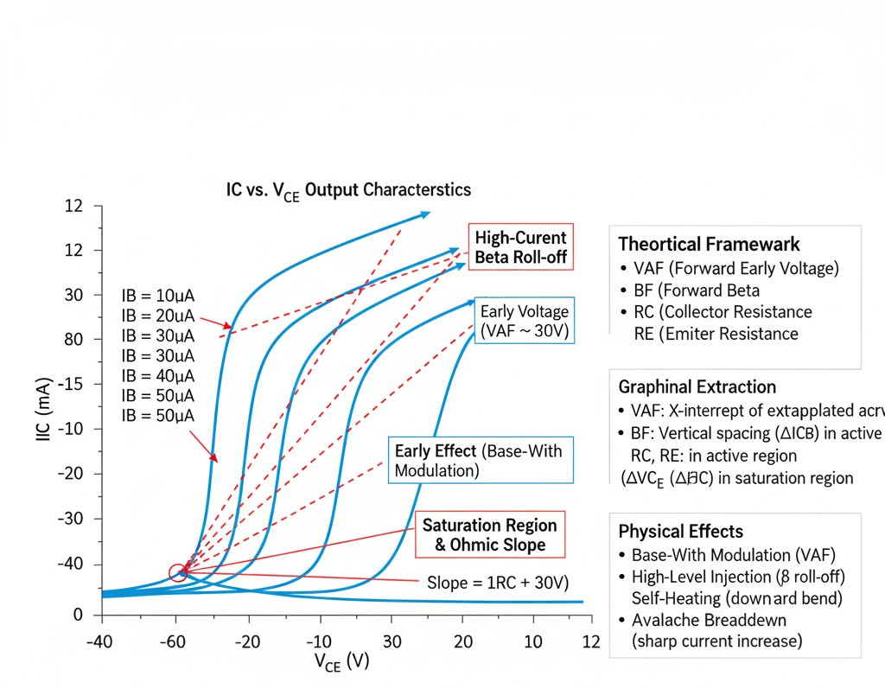

## Theory
**Introduction:**  
BJT Parameter Extraction from Forward Output Characteristics

      
      
<strong>Fig. 1. Threshold Voltage and Inversion charge</strong>

## Introduction

The **forward output characteristic** plot is a fundamental measurement for Bipolar Junction Transistors (BJTs). It provides crucial information about the transistor's behavior in the forward-active and saturation regions.

This plot is generated by applying a constant, stepped **Base Current ($I_B$)** and sweeping the **Collector-Emitter Voltage ($V_{CE}$)**, while measuring the resulting **Collector Current ($I_C$)**.

This plot ($I_C$ vs. $V_{CE}$) is used to extract key SPICE parameters that model the transistor's output conductance, saturation, and parasitic resistances.

## Key SPICE Parameters

The primary parameters extracted from this plot are:

* **`VAF` (Forward Early Voltage):** Models the slope of the $I_C$ curve in the forward-active region.
* **`RC` (Collector Series Resistance):** Models the parasitic resistance in the collector.
* **`RE` (Emitter Series Resistance):** Models the parasitic resistance in the emitter.

While the **Forward Beta (`BF`)** is *visualized* on this plot (as the spacing between curves), its ideal value is more accurately extracted from the Gummel plot.

---

## 1. Forward-Active Region: The Early Effect

In the ideal forward-active region, the collector current ($I_C$) should be independent of the collector-emitter voltage ($V_{CE}$). However, in a real BJT, $I_C$ gradually increases with $V_{CE}$.

* **Physical Cause:** This phenomenon is called **base-width modulation**, or the **Early effect**. As $V_{CE}$ increases, the reverse bias across the collector-base junction increases. This widens the collector-base depletion region, which encroaches into the neutral base, reducing the effective base width. A narrower base increases the gradient of the minority carrier concentration, thus increasing the collector current.
* **SPICE Model:** This effect is modeled by the **Forward Early Voltage (`VAF`)**. The collector current is modified by a factor:

    $$I_C = I_{C,ideal} \cdot \left( 1 + \frac{V_{CE}}{VAF} \right)$$

* **Extraction Method:**
    1.  On the $I_C$ vs. $V_{CE}$ plot, draw a tangent line along the linear, sloped portion of each curve in the active region.
    2.  Extrapolate these lines backward until they intersect the horizontal ($V_{CE}$) axis.
    3.  Ideally, all lines will converge at a single point on the negative $V_{CE}$ axis. The absolute value of this voltage intercept is the **Forward Early Voltage (`VAF`)**.

    A very large `VAF` (a far-left intercept) corresponds to very flat curves, indicating a near-ideal current source. A small `VAF` corresponds to steeply sloped curves.

---

## 2. Saturation Region: Parasitic Resistances

The saturation region is the area of the plot at low $V_{CE}$ (the "knee") where $I_C$ rises sharply before flattening out. In this region, the transistor acts less like a current source and more like a simple "on-resistance" ($R_{on}$).

* **Physical Cause:** This "on-resistance" is dominated by the parasitic series resistances in the collector and emitter, modeled by **`RC`** and **`RE`**.
* **SPICE Model:** The total collector-emitter saturation voltage ($V_{CE,sat}$) is the sum of the internal junction voltages and the voltage drops across these parasitic resistors:

    $$V_{CE,sat} \approx V_{CE,sat,internal} + I_C \cdot RC + I_E \cdot RE$$

    Since $I_E \approx I_C$ at high gain, this simplifies to:

    $$V_{CE,sat} \approx V_{CE,sat,internal} + I_C \cdot (RC + RE)$$

* **Extraction Method:**
    1.  The parameters `RC` and `RE` are extracted from the slope of the $I_C$ vs. $V_{CE}$ curves in the deep saturation region. This slope represents the "on-resistance":
        $$R_{on} = \frac{\Delta V_{CE}}{\Delta I_C} \approx RC + RE$$
    2.  Specialized methods (e.g., the "open-collector" method or comparing slopes at different $I_B$ levels) are required to separate the individual contributions of `RC` and `RE` from the total measured resistance.
    3.  A large `RC` also causes the "knee" to be "softer," an effect known as **quasi-saturation**. This is because the internal $I_C \cdot RC$ voltage drop causes the *internal* base-collector junction to become forward-biased *before* the *external* $V_{CE}$ drops to its saturation level.

---

## Other Observable Effects

* **High-Current Beta Roll-Off:** At high collector currents, the curves will appear to "bunch up" or "crowd together." This means the vertical spacing (which represents $\Delta I_C$) for a constant $\Delta I_B$ decreases, visualizing the drop in current gain (beta).
* **Self-Heating:** At high power levels (both high $I_C$ and high $V_{CE}$), the device heats up. This can cause the $I_C$ curves to bend *downward* as $V_{CE}$ increases, because gain typically decreases at higher temperatures.
* **Breakdown:** At very high $V_{CE}$ (beyond the normal operating range), the $I_C$ curves will suddenly and sharply turn upward. This is **avalanche breakdown** of the collector-base junction.

     
 
